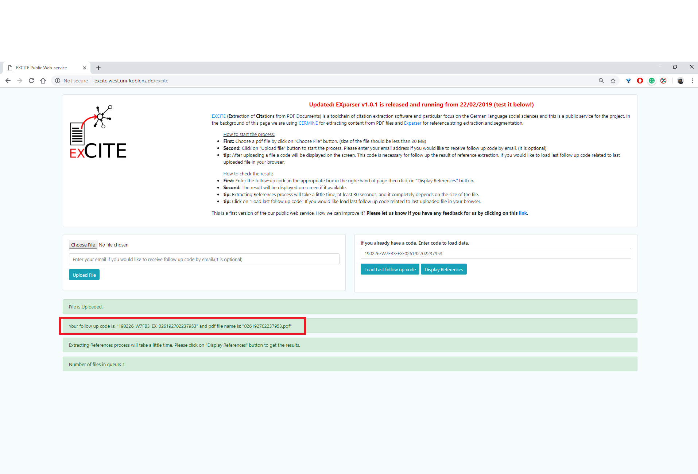
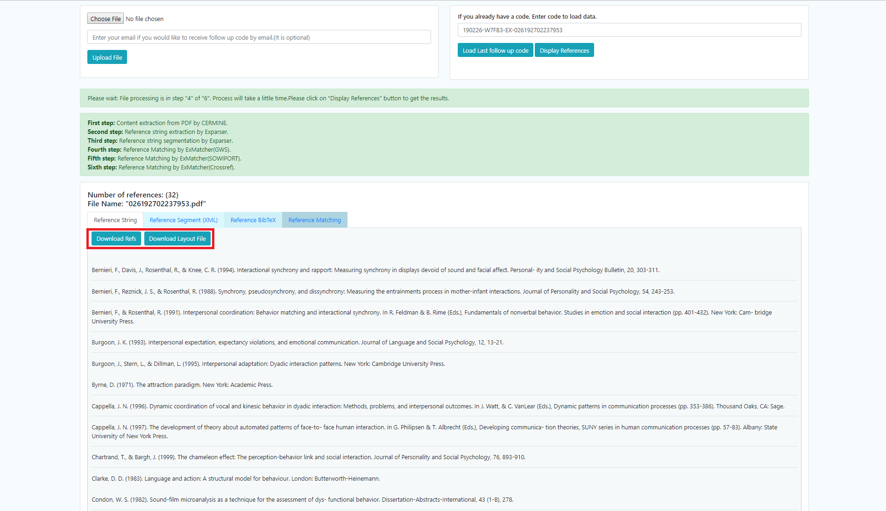
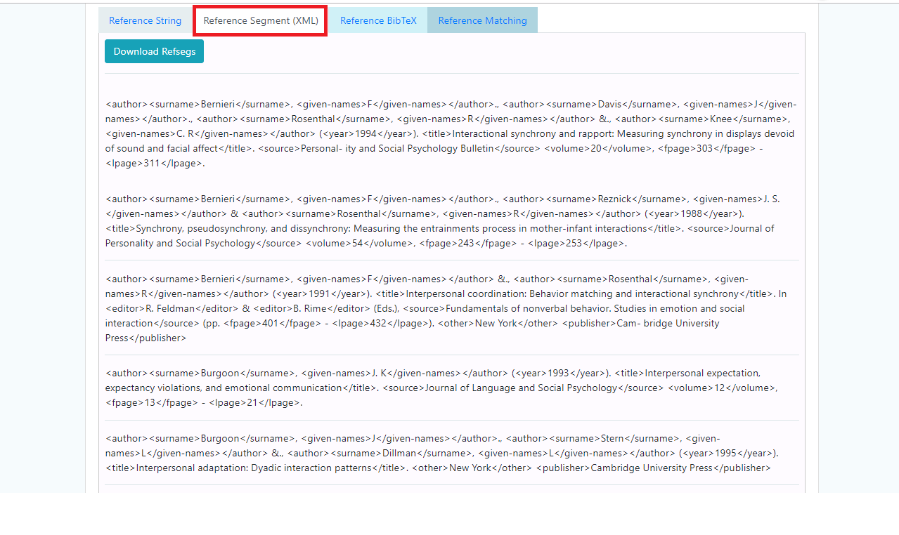
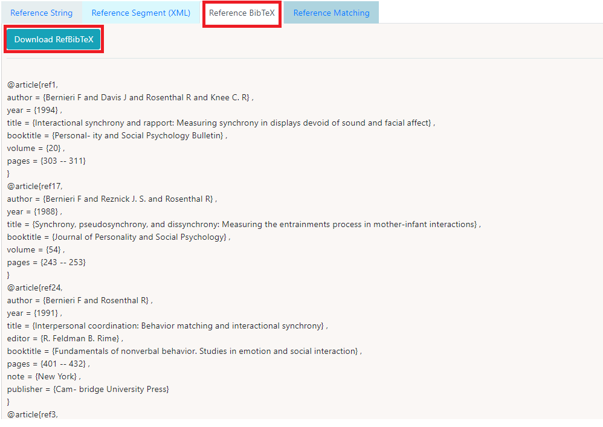

The [Online Demo](http://excite.west.uni-koblenz.de/excite) allows to extract segmented reference strings from your PDF documents in XML, BibTex and Text formats. 

## Steps:
1.  Select the PDF document from your computer.

2. Upload the file by clicking the ***Upload File*** button. Additionally you can also provide your email-id if you want to receive the follow up code.

3. A code (highlighted in the red box) is generated for the file under processing.

4. Once the complete process is complete you will receive an email if provided and the results of Reference extraction and Reference Parsing are made available in the result section and can be downloaded as highlighted in the figure.

5. Enter the generated code to visualise the result of the complete process. The result of reference extraction can be found under the ***Reference String*** tab.

6. The annotated references can be viewed in the ***Reference Segmentation(XML)*** tab.

7. The extracted references can also be downloaded in BibTex format from ***Reference BibTex*** tab.

