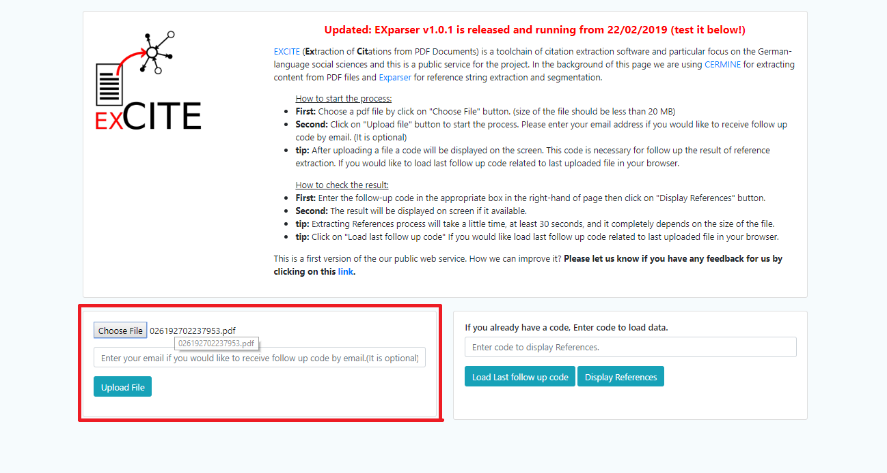
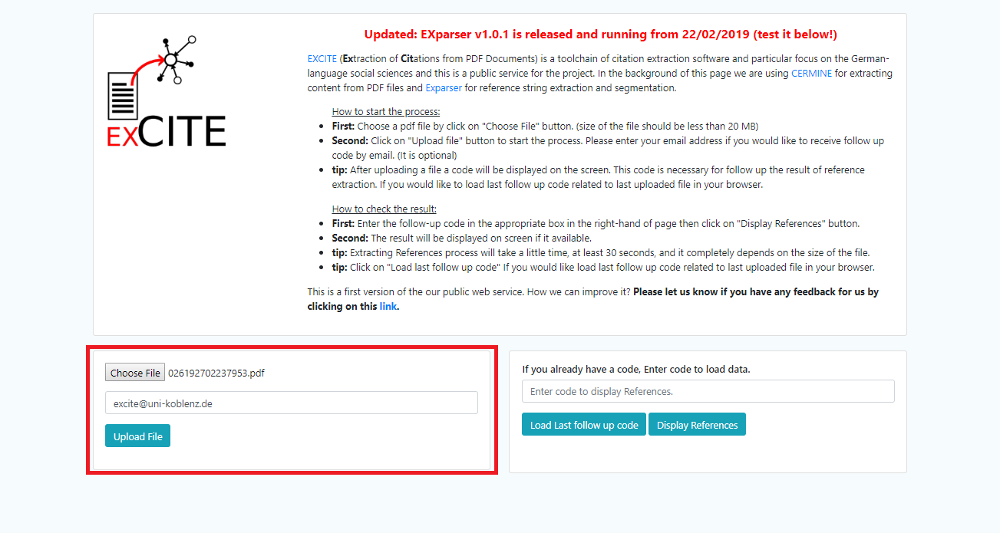
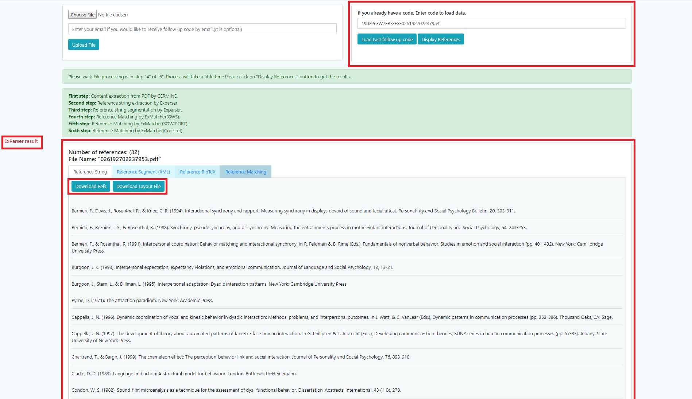

The [Online Demo](http://excite.west.uni-koblenz.de/excite) allows to extract segmented reference strings from your PDF documents in XML, BibTex and Text formats. 

## Steps:
1.  Select the PDF document from your computer.

2. Upload the file by clicking the ***Upload File*** button.

3. Enter your email address if you want to receive the follow up code.

4. A code is generated for the file under processing.

5. You will receive an email once the process is finished.
6. Enter the generated code to visualise the segmented reference strings.

* Click to download if you want to save the references.
