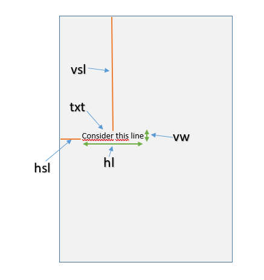

In order to train the reference extraction model the training data should be prepared considering the following guideline.

For each reference found in the document, it should be enclosed in  &lt;ref&gt; &amp; &lt;/ref&gt; tags.

Example. (the following snippet is from the complete pdf to text document.)

**&lt;ref&gt;** Taggert, Paul; Szczerbiak, Aleks (2004): Contemporary Euroscepticism in the Party Systems of the European Union Candidate States of Central and Eastern Europe. European Journal of Political Research, 43, 1, S. 1-27.**&lt;/ref&gt;**

**&lt;ref&gt;**Tömmel, Ingeborg (2006): Die Reform der Strukturpolitik der EU – Eine Reform europäischer	Governance? In: Kleinfeld, Ralf; Plamper, Harald; Huber, Andreas (Hrsg.): Regional Governance. Steuerung, Koordination und Kommunikation in regionalen Netzwerken als neue Formen des Regierens. Göttingen: V&R unipress. S. 183-200.**&lt;/ref&gt;**

Additionally the layout information of the PDF document is also required. This can be obtained using the Cermine api which generates an .CSV file containing the co-ordinates for each lines. **Add link to the RefExt and a code snippet.**
For each line found in the PDF document the co-ordinates value for five different columns is generated. They are as follows

*  **txt**: the text of each line.
*  **hsl**: the horizontal space line.
*  **vsl**: the vertical space linw within the page.
*  **vw**: the vertical width of the line.
*  **hl**: the horizontal length of the line.
*  **pn**: the number of the paragraph.

Please refer to the image for better understanding of the layout information.

